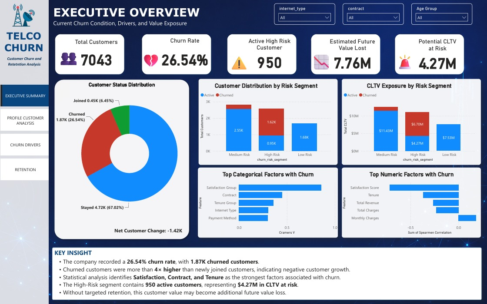
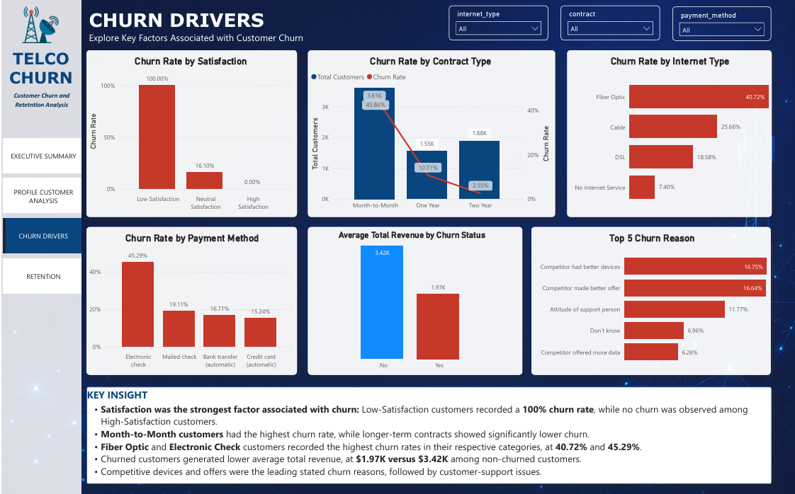
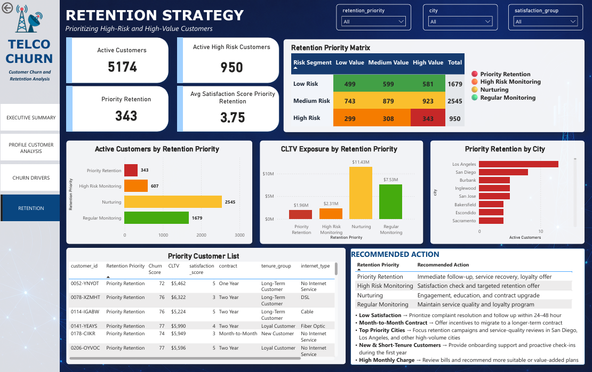

# churn_telco_analysis
Customer churn analysis using Python, statistical testing, customer segmentation, and Power BI to identify key churn factors and prioritize retention strategies.

# Telco Customer Churn and Retention Analysis

## Project Overview

This project analyzes customer churn in a telecommunications company using Python, statistical testing, customer segmentation, and Power BI.

The analysis uses data from **7,043 customers** to identify the main factors associated with churn, understand customer characteristics across different segments, and determine which active customers should be prioritized for retention.

## Business Problem

Telecommunication companies operate in a highly competitive market where customer retention is essential for sustainable business growth. Based on the initial analysis, the company is experiencing a **26.54% customer churn rate**, indicating that approximately **1 in 4 customers** has discontinued the service.

A total of **2,565 customers** were classified as High Risk, and **950** of them remain active. These active High-Risk customers represent approximately **$4.27M in CLTV at risk**, highlighting the potential future customer value that could be lost without targeted retention actions.
This project aims to answer the following questions:

1. Why are customers churning?
2. Which factors are most associated with customer churn?
3. Which customers should be prioritized for retention?
4. What retention strategies can help reduce churn while protecting high-value customers?

## Dataset

The dataset was obtained from Kaggle:

**Why Do Customers Leave? Can You Spot the Churners?**
https://www.kaggle.com/datasets/hassanelfattmi/why-do-customers-leave-can-you-spot-the-churners/data

The original data consists of six tables:

- Customer information
- Customer status
- Payment information
- Service options
- Online services
- Location data

All tables were merged using `customer_id`.

## Tools and Technologies

- Python
- Pandas
- NumPy
- Matplotlib
- Seaborn
- SciPy
- Google Colab
- Power BI
- GitHub

## Analysis Process

### 1. Data Preparation

The data preparation process included:

- Downloading the dataset using KaggleHub
- Merging six customer tables
- Checking duplicate customer IDs
- Consolidating duplicate columns after merging
- Handling missing values
- Selecting relevant variables
- Standardizing column names and data types

### 2. Feature Engineering

Several new features were created:

- Age group
- Tenure group
- Monthly charge group
- Satisfaction group
- Total services used
- CLTV segment
- Churn risk segment
- Retention priority

### 3. Exploratory Data Analysis

The analysis explored churn based on:

- Customer satisfaction
- Contract type
- Payment method
- Monthly charges
- Customer tenure
- Internet type
- Online security
- Premium technical support
- Churn reasons

### 4. Statistical Analysis

The following statistical methods were used:

- Chi-Square Test
- Cramer's V
- Mann-Whitney U Test
- Spearman Correlation

These methods were used to determine whether customer characteristics were significantly associated with churn and to measure the strength of those relationships.

## Key Findings

### Overall Churn

- Total customers: **7,043**
- Churned customers: **1,869**
- Overall churn rate: **26.54%**

### Customer Satisfaction

Customer satisfaction showed the strongest relationship with churn.

- Low Satisfaction: **100% churn rate**
- Neutral Satisfaction: **16.10% churn rate**
- High Satisfaction: **0% churn rate**

This pattern indicates that satisfaction surveys can be used as an important monitoring tool to identify dissatisfied customers and support early retention actions.

### Contract Type

Customers with shorter contracts were more vulnerable to churn.

- Month-to-Month: **45.84%**
- One Year: **10.71%**
- Two Year: **2.55%**

Longer-term contracts were associated with stronger customer retention.

### Customer Tenure

Churn decreased as customer tenure increased.

- New Customer: **52.94%**
- Short Tenure: **35.89%**
- Medium Tenure: **28.71%**
- Loyal Customer: **20.39%**
- Long-Term Customer: **9.51%**

The first months of the customer relationship represent the most critical period for retention.

### Internet Type

Fiber Optic customers recorded the highest churn rate.

- Fiber Optic: **40.72%**
- Cable: **25.66%**
- DSL: **18.58%**
- No Internet Service: **7.40%**

This indicates that Fiber Optic customers may experience a gap between service expectations and the value received.

### Payment Method

Electronic Check customers had the highest churn rate.

- Electronic Check: **45.29%**
- Mailed Check: **19.11%**
- Bank Transfer Automatic: **16.71%**
- Credit Card Automatic: **15.24%**

Automatic payment methods were associated with lower churn.

### Monthly Charges

Customers with higher monthly charges were more likely to churn.

- High Charge: **34.09%**
- Medium Charge: **29.68%**
- Low Charge: **15.87%**

Customers paying higher fees may have stronger expectations regarding service quality and value.

### Premium Technical Support

Customers without Premium Tech Support had a higher churn rate.

- Without Premium Tech Support: **31.19%**
- With Premium Tech Support: **15.17%**

Technical support may help resolve customer issues before dissatisfaction leads to churn.

### Main Churn Reasons

The leading churn reasons were:

1. Competitor had better devices: **16.75%**
2. Competitor made a better offer: **16.64%**
3. Attitude of support person: **11.77%**
4. Competitor offered more data: **6.26%**
5. Competitor offered higher download speeds: **5.35%**

The results show that churn was mainly related to competitive offers and customer-service experience.

## Statistical Findings

The strongest categorical relationships with churn were:

| Variable | Cramer's V | Relationship |
|---|---:|---|
| Satisfaction Group | 0.859 | Very Strong |
| Contract | 0.453 | Strong |
| Tenure Group | 0.363 | Moderate |
| Internet Type | 0.305 | Moderate |
| Payment Method | 0.303 | Moderate |

The strongest numerical relationships were:

| Variable | Spearman Correlation |
|---|---:|
| Satisfaction Score | -0.717 |
| Tenure | -0.367 |
| Total Revenue | -0.264 |
| Total Charges | -0.231 |
| Monthly Charges | 0.185 |

Customer satisfaction and tenure provided the clearest descriptive signals associated with churn.

## Customer Risk Segmentation

Customers were divided into three churn-risk segments using the available `churn_score`.

| Risk Segment | Total Customers | Churn Rate |
|---|---:|---:|
| High Risk | 2,565 | 62.96% |
| Medium Risk | 2,799 | 9.07% |
| Low Risk | 1,679 | 0.00% |

The High Risk segment included **950 active customers** who had not yet churned. These customers represent the main target for retention efforts.

The `churn_score` was already provided in the dataset and was used as an operational segmentation tool. This project did not develop a new churn prediction model.

## Business Recommendations

1. **Prioritize active High Risk customers**  
   Focus retention efforts on active customers with high churn scores and high CLTV.

2. **Use satisfaction surveys for monitoring**  
   Identify low-satisfaction customers early and provide proactive follow-up.

3. **Improve complaint resolution**  
   Strengthen service recovery, response time, and customer-support quality.

4. **Encourage longer-term contracts**  
   Offer loyalty benefits or renewal incentives to Month-to-Month customers.

5. **Strengthen customer onboarding**  
   Monitor new customers during the first 30, 60, and 90 days.

6. **Review Fiber Optic services**  
   Evaluate network reliability, pricing, technical support, and customer expectations.

7. **Promote automatic payments**  
   Encourage Electronic Check customers to switch to automatic payment methods.

8. **Improve competitive offerings**  
   Review devices, data packages, internet speed, and pricing compared with competitors.

## Dashboard Preview

### Executive Overview



### Churn Drivers



### Numerical Analysis


### Retention Strategy



## Repository Structure

```text
telco-customer-churn-analysis/
├── README.md
├── requirements.txt
├── notebooks/
│   └── Telco_Customer_Churn_and_Retention_Analysis.ipynb
├── powerbi/
│   └── telco_churn_dashboard.pbix
├── assets/
│   ├── dashboard_overview.png
│   ├── churn_drivers.png
│   ├── numeric_analysis.png
│   └── retention_strategy.png
└── data/
    └── telco_churn_final_analysis.csv
